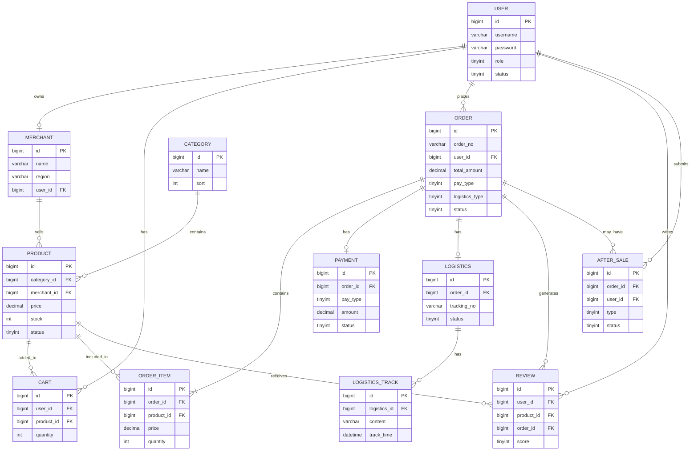

# 基于Spring Boot+Vue的跨境电商平台设计与实现
## 技术
### 后端技术: 
    Spring Boot、MySQL、Redis、Spring Security，
### 前端技术：
    Vue、Element UI、Axios
## 项目描述：
    基于Spring Boot+Vue的跨境电商平台是一个在线购物平台，旨在为消费者提供跨境购物的服务。该平台连接全球不同地区的商家和消费者，通过网页浏览器作为客户端，实现商品展示、订单管理、支付结算等功能，为消费者提供方便的跨境购物体验。

## 功能介绍：

| 功能     | 内容                                                                                  |
|--------|-------------------------------------------------------------------------------------|
| 商品展示：  | 平台上展示来自**不同地区**商家的商品，包括服装、鞋类、配件、家居用品等，消费者可以通过浏览器**浏览**商品信息、价格和图片，选择心仪的商品。           |
| 购物车管理： | 消费者可以将选择的商品**加入购物车**，并进行**数量调整和删除**等操作。购物车功能方便消费者**管理和结算**多个商品，同时提供***实时价格和库存***信息。 |
| 订单管理：  | 消费者可以在平台上提交订单，并选择**付款方式**和**物流方式**。平台提供**订单详情和状态跟踪**，方便消费者查看**订单进度和历史订单记录**。        |
| 支付结算：  | 平台提供***多种支付方式***，如信用卡、支付宝、微信支付等。消费者可以选择合适的支付方式进行付款，平台通过与***第三方支付机构***对接，实现跨境支付和结算。  |
| 物流追踪：  | 平台提供***物流跟踪***功能，消费者可以在平台上查看***包裹的物流状态和预计到达时间***。平台与不同物流公司对接，实时更新物流信息。              |
| 评价和评分： | 消费者可以在平台上对购买的商品进行***评价和评分***，为其他消费者提供参考。平台提供用户评价和评分的展示，帮助消费者做出更明智的购物决策。             |
| 售后服务：  | 平台为消费者提供售后服务，包括***退货、换货、投诉***等。消费者可以在平台上提交***售后申请***，并与卖家进行沟通和协商解决问题。               |

---
## 规划
### MVP
1. 用户注册 / 登录（ Spring Security + Session）( JWT未来考虑换？暂时不用 ) 
    （注册 = 前端表单校验 → 后端业务校验 → 写 user 表 → （可选）卖家再写 merchant 表 → 返回与登录一致的 JSON。）
2. 商品展示（分类、列表、详情、多地区商家）
3. 购物车（增删改、库存校验）
4. 下单（生成订单、选支付方式 / 物流方式）
5. 订单列表 / 详情 / 状态

### ER图

create database if not exit cross-mall

### 数据库表（共 12 张）

| 表名              | 说明             | 阶段    |
|-----------------|----------------|-------|
| user            | 用户（买家/卖家/管理员）  | MVP   |
| merchant        | 商家（含地区 region） | MVP   |
| category        | 商品分类           | MVP   |
| product         | 商品（含库存）        | MVP   |
| cart            | 购物车            | MVP   |
| order           | 订单             | MVP   |
| order_item      | 订单明细           | MVP   |
| payment         | 支付记录（模拟）       | 第 6 步 |
| logistics       | 物流信息           | 第 6 步 |
| logistics_track | 物流轨迹节点         | 第 6 步 |
| review          | 商品评价           | 第 7 步 |
| after_sale      | 售后申请           | 第 7 步 |

建表 SQL 见项目根目录 `sql.sql`。

### 后端规划
    1. 统一响应，异常
    2. 用户+Security
    3. 商家，商品，分类
    4. 购物车
    5. 订单
    6. 支付，物流
    7. 评价，售后

### 前端规划
    1. 登录，注册
    2. 首页+商品列表+商品详情
    3. 购物车
    4. 下单页+订单列表、详情
    5. 个人中心（评价，售后）

## 《企业级应用系统开发能力训练》实训课结课要求：
    1. 没有上软通动力实训课的同学需要按照要求完成该课程结课报告；
    2. 以小组为单位完成报告，学生可自由组队，每队人数不超过5人；
    3. 期末（19-20周）提交实训报告、系统（源代码）、答辩PPT至班长处，文件以“组长学号＋姓名”命名；
    4. 各班班长在收齐后打包发送至邮箱：82885366@qq.com，以班级+实训结课作业命名；
    5. 请大家认真对待实训课结课作业并按时按质完成，最后会要求答辩，请大家做好答辩准备。
