# CrossMall 跨境电商平台 — 系统设计图集

> 项目：基于 Spring Boot + Vue 的跨境电商平台  
> 用途：实训报告「系统分析」「系统设计」章节插图  
> ER 图自 `cross-mall/Request.md` 迁移至此，其余图为本项目补充。

---

## 1. E-R 图（数据库设计）

描述 12 张表及其主外键关系。

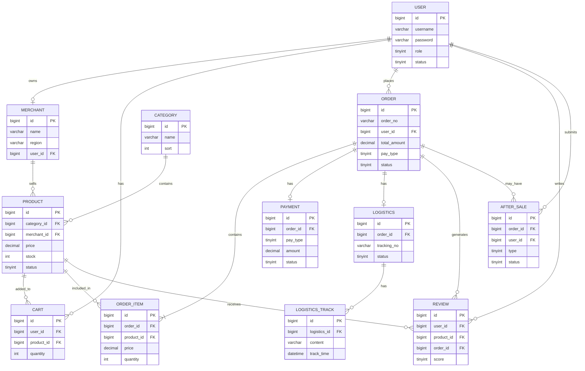

### 表清单

| 表名 | 说明 |
|------|------|
| user | 用户（买家/卖家/管理员） |
| merchant | 商家及所在地区 |
| category | 商品分类 |
| product | 商品及库存 |
| cart | 购物车 |
| order | 订单主表 |
| order_item | 订单明细 |
| payment | 支付记录（模拟） |
| logistics | 物流信息 |
| logistics_track | 物流轨迹节点 |
| review | 商品评价 |
| after_sale | 售后申请 |

---

## 2. 用例图（需求分析）

三种角色与主要用例。Mermaid 无标准用例图语法，以下用流程图表达同等语义。

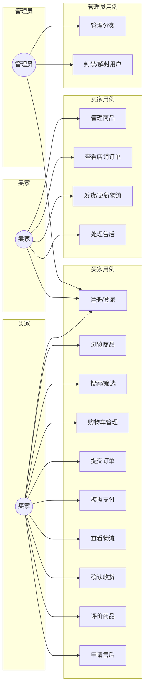

### 用例说明（节选）

| 用例 | 参与者 | 描述 |
|------|--------|------|
| 提交订单 | 买家 | 从购物车生成订单，校验库存与商品状态 |
| 模拟支付 | 买家 | 选择支付宝/微信/信用卡，更新订单与支付记录 |
| 发货 | 卖家 | 填写物流公司，生成运单号，追加物流轨迹 |
| 管理分类 | 管理员 | 增删改商品分类，影响前台筛选 |

---

## 3. 数据流图（DFD）

### 3.1 顶层数据流图（0 层）

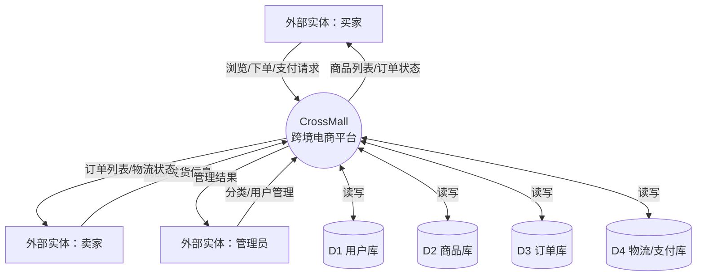

### 3.2 下单子过程（1 层展开）

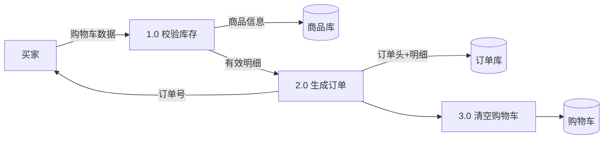

---

## 4. 类图（核心领域模型）

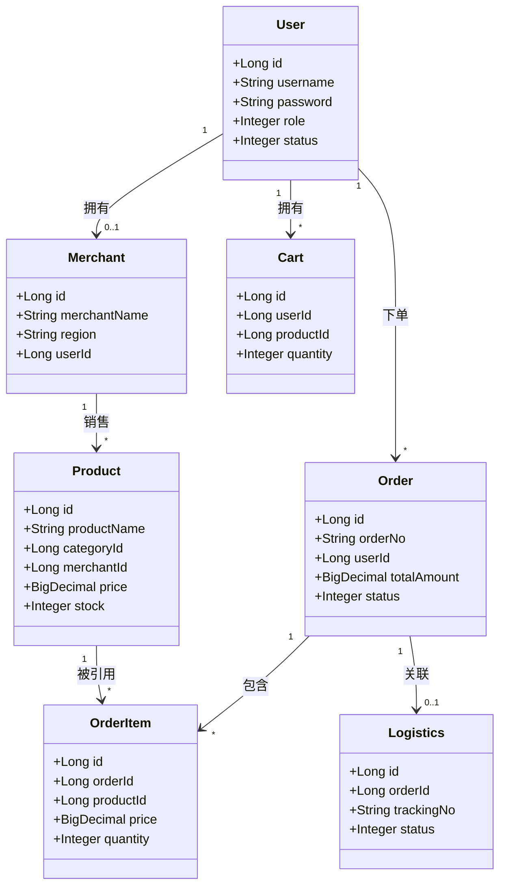

### 4.2 后端分层类图（简化）

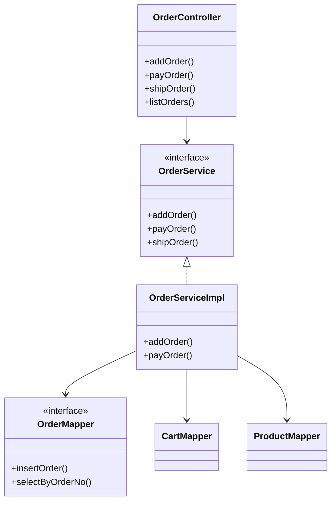

---

## 5. 顺序图

### 5.1 用户下单

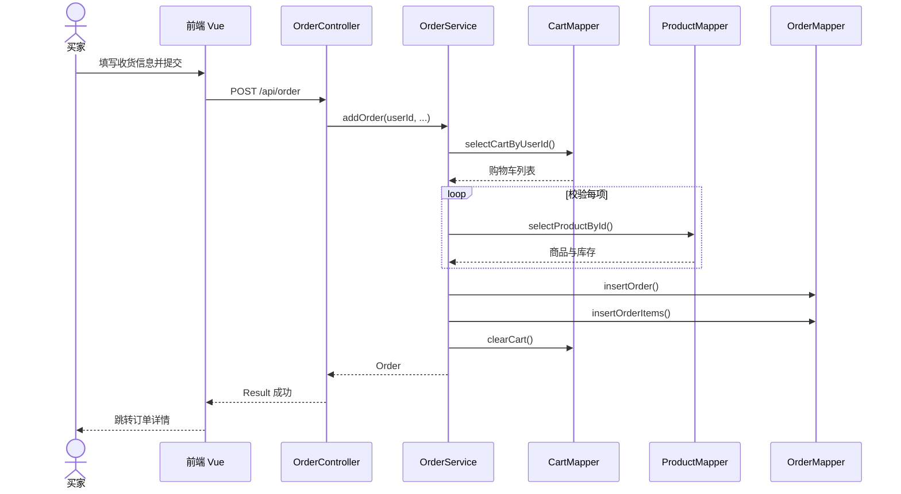

### 5.2 卖家发货

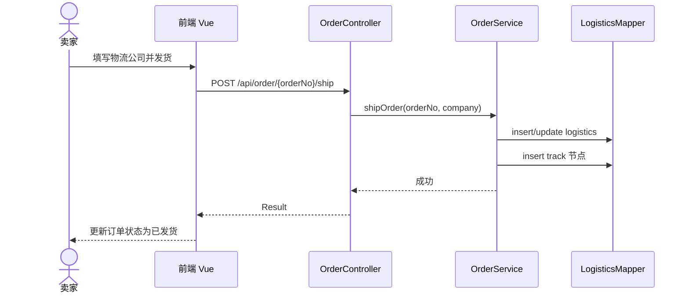

### 5.3 用户登录（Spring Security + Redis Session）

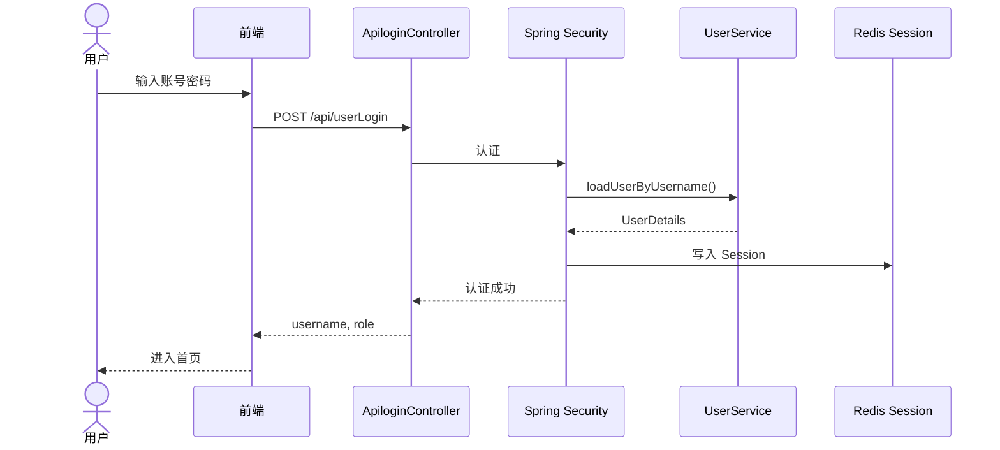

---

## 6. 系统架构图

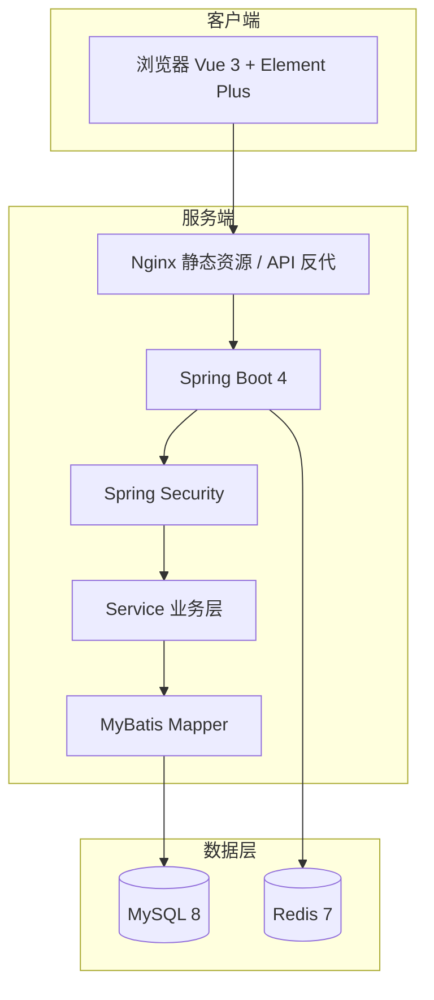

---

## 7. 订单状态流转

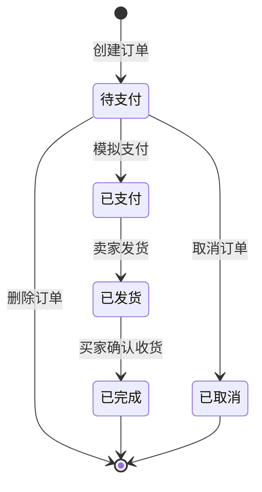

---

*说明：在 VS Code / Typora / GitHub 等支持 Mermaid 的编辑器中可直接预览上述图表。答辩 PPT 可截图本页或导出为图片插入。*
